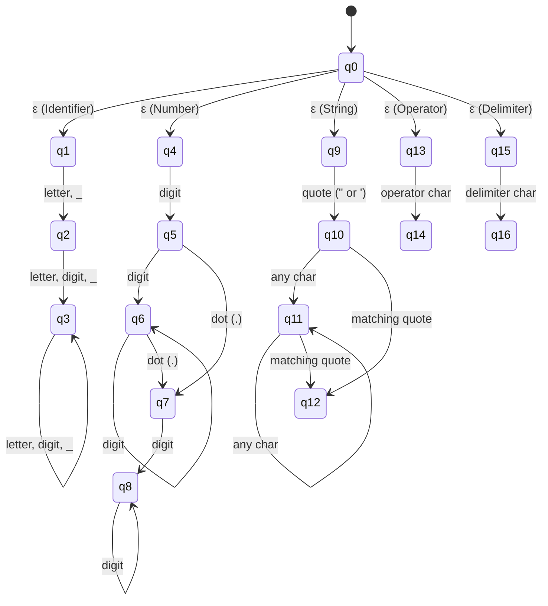
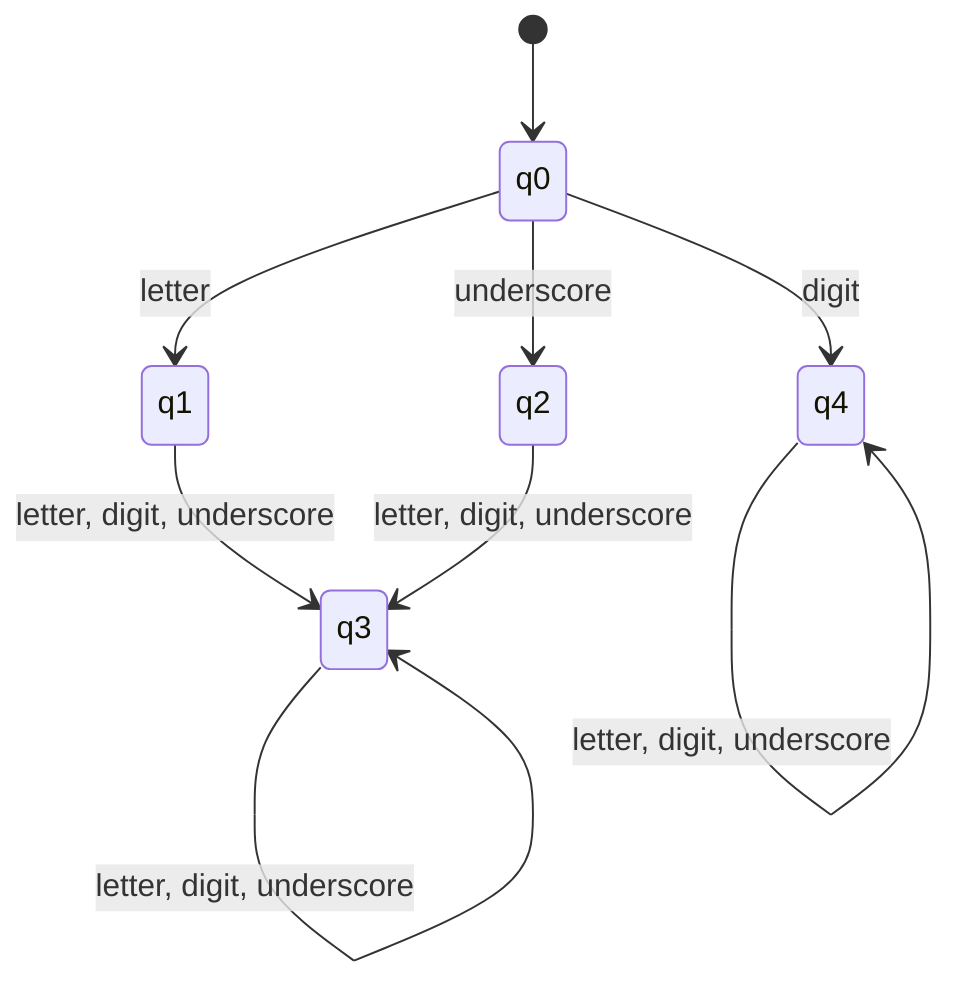
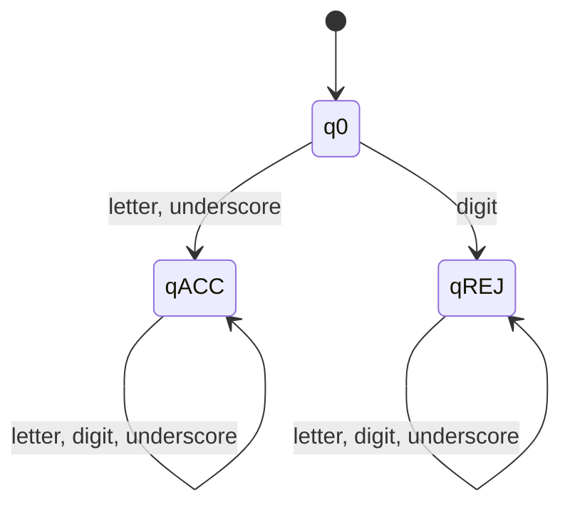

# Automata Final Project

**Simple Lexical Analyzer (LexiScan)**

### Members
* Salazar, Franz E.
* Berto, James A.
* Bote, Matthew John
* Culubong, Bench Matthew C.
* De Chavez, Leona Charlize D.
* Gamboa, Jhon Roy B.
* Prodigalidad, Jude Renwell B.
* Sandoval, Christian Ace E.
* Santos, ALecks Rejina D.

**Submitted To:** Prof. Susan Caluya

---

## Table of Contents
1. [Introduction](#introduction)
2. [Project Objectives](#project-objectives)
3. [Scope and Limitations](#scope-and-limitations)
4. [Formal Language Definition](#formal-language-definition)
5. [Alphabet and Strings](#alphabet-and-strings)
6. [Accepted and Rejected Input](#accepted-and-rejected-input)
7. [Examples](#examples)
8. [Regular Expression](#regular-expression)
9. [NFA Formal Definition](#nfa-formal-definition)
10. [NFA Transition Table and Diagram](#nfa-transition-table-and-diagram)
11. [NFA-to-DFA Conversion](#nfa-to-dfa-conversion)
12. [DFA Transition Table and Diagram](#dfa-transition-table-and-diagram)
13. [DFA Minimization](#dfa-minimization)
14. [Minimized DFA Diagram](#minimized-dfa-diagram)
15. [System Design](#system-design)
16. [Implementation/Source Code](#implementationsource-code)
17. [Test Cases and Results](#test-cases-and-results)
18. [Screenshots of the Working System](#screenshots-of-the-working-system)
19. [Discussion of Results](#discussion-of-results)
20. [Conclusion](#conclusion)
21. [References](#references)
22. [Individual Contribution Matrix](#individual-contribution-matrix)

---

## Introduction

In compiler design and the theory of computation, the **lexical analyzer** (often termed scanner or lexer) serves as the foundational initial phase of a language translation pipeline. Its primary theoretical and practical responsibility is to read an unbroken linear stream of source characters, filter out non-essential syntactic trivia (such as insignificant whitespace and comments), verify alphabet membership, and aggregate character sequences into meaningful atomic units called **lexemes**. Each recognized lexeme is categorized into a formal syntactic category termed a **token**.

The mathematical bedrock underlying lexical analysis is **Automata Theory** and **Formal Language Theory**. Regular languages, the lowest level in the Chomsky hierarchy (Type-3 languages), provide the formal expressive power required to model tokens such as identifiers, numeric literals, keywords, operators, and delimiters. Regular expressions (REs) declaratively define valid token patterns, which are mechanically translated into Non-deterministic Finite Automata (NFAs) using Thompson's construction or union architectures. To make scanning computationally deterministic and optimal, NFAs are converted into Deterministic Finite Automata (DFAs) via the Subset Construction algorithm, and further minimized using Partition Refinement (Hopcroft/Moore equivalence partitioning).

This project presents **LexiScan**, a high-performance, stateless, and mathematically rigorous Simple Lexical Analyzer. Built collaboratively by a nine-member engineering team, LexiScan bridges abstract theoretical computer science with modern full-stack web engineering. The system features a responsive, glassmorphic React/TypeScript user interface paired with a high-throughput Python/FastAPI backend engine. LexiScan not only tokenizes complex program inputs using a Deterministic Finite Automaton and the Maximal Munch principle, but also exposes interactive state machine visualizations, step-by-step equivalence partitions, and live transition tracing.

---

## Project Objectives

### Primary Objective
To design, mathematically formalize, and implement an end-to-end Simple Lexical Analyzer founded upon finite state automata that scans source text, verifies alphabet membership, classifies lexemes into precise token classes, detects lexical anomalies with coordinate tracking, and visualizes underlying automata transitions.

### Specific Objectives
1. **Formal Language Specification**: Rigorously specify the alphabet $\Sigma$, formal regular languages, and regular expressions for all recognized token categories: Identifiers, Reserved Keywords, Numeric Literals (Integers and Floats), String Literals, Arithmetic and Comparison Operators, and Delimiters/Punctuation.
2. **NFA Modeling and Union Construction**: Construct a comprehensive Multi-Token Non-deterministic Finite Automaton (NFA) incorporating $\varepsilon$-transitions to demonstrate non-deterministic branching across distinct token recognition paths.
3. **NFA-to-DFA Conversion**: Execute the Subset Construction algorithm to convert the non-deterministic automaton into an equivalent Deterministic Finite Automaton (DFA), tabulating intermediate state subsets and transition functions.
4. **DFA Minimization**: Apply the Partition Refinement algorithm (Hopcroft's equivalence partitioning) to systematically eliminate redundant states, reducing the state space to its canonical minimal form.
5. **Algorithmic Lexing with Maximal Munch**: Implement a hybrid scanner that executes deterministic state machine traversal for structured variable-length tokens while applying the Maximal Munch (longest-match) rule to resolve token boundary ambiguities.
6. **Error Detection and Coordinate Precision**: Develop a robust diagnostic mechanism that flags ill-formed tokens, unterminated literals, and unrecognized characters, reporting exact line and column numbers.
7. **Interactive Web Visualization and Automated Verification**: Build a rich, production-grade web application (LexiScan) featuring interactive automata diagrams, live transition trace panels, and an automated verification test suite evaluating 10 accepted and 10 rejected test cases with a 100% pass rate.

---

## Scope and Limitations

### Scope
* **Recognized Token Families**:
  * **Identifiers**: Variable and function names adhering to $(letter \mid \_)(letter \mid digit \mid \_)^*$.
  * **Keywords**: Case-sensitive reserved words including `let`, `const`, `var`, `function`, `return`, `if`, `else`, `for`, `while`, `print`, `true`, `false`, `null` (and Python equivalents in the backend).
  * **Numbers**: Decimal integers ($[0\text{-}9]^+$) and double-precision floating-point numbers ($[0\text{-}9]^+\.[0\text{-}9]^+$).
  * **Strings**: Single-quoted (`'...'`) and double-quoted (`"..."`) string literals.
  * **Operators**: Arithmetic (`+`, `-`, `*`, `/`, `%`), assignment (`=`), equality/relational (`==`, `!=`, `<`, `>`, `<=`, `>=`), and bitwise symbols (`&`, `|`, `^`).
  * **Delimiters and Punctuation**: Parentheses (`()`), braces (`{}`), brackets (`[]`), comma (`,`), semicolon (`;`), colon (`:`), and member access dot (`.`).
* **Source Tracking**: Complete line and column coordinate tracking for every emitted token and syntax diagnostic.
* **Lexer Capabilities**: Maximal munch token aggregation, single-line comment skipping (`#`), live DFA state trace inspection, and file upload ingestion (`.js`, `.py`, `.lex`, `.txt`).
* **Architecture**: Decoupled, stateless client-server design with an interactive React 19 frontend and a typed FastAPI Python backend.

### Limitations
* **Lexical Phase Boundary**: LexiScan operates strictly as a Phase 1 compiler frontend; it does not construct Abstract Syntax Trees (ASTs), perform context-free grammar parsing (syntax analysis), or execute semantic type checking.
* **Complex Numeric Literals**: Hexadecimal (`0x...`), binary (`0b...`), octal (`0o...`), and scientific exponential notations (`1.2e-4`) are outside the primary regular grammar and will be processed as separate numeric and identifier tokens.
* **Multi-line Strings and Escape Sequences**: Multi-line raw strings and complex backslash escape sequences (e.g., unicode escapes `\uXXXX`) are not expanded into escape code points.
* **Single-line Comments Only**: Single-line comments beginning with `#` are supported; multi-line block comments (e.g., `/* ... */`) are not recognized in this version.

---

## Formal Language Definition

In formal language theory, a language $L$ over an alphabet $\Sigma$ is a subset of $\Sigma^*$, the set of all strings formed by symbols from $\Sigma$. The total language recognized by LexiScan, denoted $L_{\text{LexiScan}}$, is the union of mutually disjoint token languages:

$$L_{\text{LexiScan}} = L_{\text{ID}} \cup L_{\text{KEY}} \cup L_{\text{INT}} \cup L_{\text{FLOAT}} \cup L_{\text{STR}} \cup L_{\text{OP}} \cup L_{\text{DELIM}}$$

### 1. Identifier Language ($L_{\text{ID}}$)
An identifier begins with an alphabetic letter or an underscore, followed by any sequence of letters, digits, or underscores, excluding reserved keywords:
$$L_{\text{ID}} = \left\{ w \in (\Sigma_L \cup \{\_\})(\Sigma_L \cup \Sigma_D \cup \{\_\})^* \right\} \setminus L_{\text{KEY}}$$

### 2. Keyword Language ($L_{\text{KEY}}$)
The finite set of reserved strings designated by the language specification:
$$L_{\text{KEY}} = \{\text{"let"}, \text{"const"}, \text{"var"}, \text{"function"}, \text{"return"}, \text{"if"}, \text{"else"}, \text{"for"}, \text{"while"}, \text{"print"}, \text{"true"}, \text{"false"}, \text{"null"}\}$$

### 3. Integer Number Language ($L_{\text{INT}}$)
The language of unsigned integer literals consisting of one or more decimal digits:
$$L_{\text{INT}} = \{ w \in \Sigma_D^+ \}$$

### 4. Floating-Point Number Language ($L_{\text{FLOAT}}$)
The language of fractional numbers containing one or more digits before and after a decimal point:
$$L_{\text{FLOAT}} = \{ w_1 . w_2 \mid w_1 \in \Sigma_D^+, w_2 \in \Sigma_D^+ \}$$

### 5. String Literal Language ($L_{\text{STR}}$)
The set of character sequences bounded by identical quotation marks (single or double) containing no unescaped newlines:
$$L_{\text{STR}} = \left\{ "s" \mid s \in (\Sigma \setminus \{\text{'\textbackslash n'}, '"'\})^* \right\} \cup \left\{ 's' \mid s \in (\Sigma \setminus \{\text{'\textbackslash n'}, '\''\})^* \right\}$$

### 6. Operator Language ($L_{\text{OP}}$)
The set of mathematical, logical, and comparison operators:
$$L_{\text{OP}} = \{ +, -, *, /, \%, =, ==, !=, <, >, <=, >=, \&, |, \hat{\ } \}$$

### 7. Delimiter Language ($L_{\text{DELIM}}$)
The set of punctuation and structural enclosure symbols:
$$L_{\text{DELIM}} = \{ (, ), \{, \}, [, ], ,, ;, :, . \}$$

---

## Alphabet and Strings

The universal input alphabet $\Sigma$ represents all valid characters accepted by the lexical analyzer:

$$\Sigma = \Sigma_L \cup \Sigma_D \cup \{ \text{\_} \} \cup \Sigma_{OP} \cup \Sigma_{DELIM} \cup \Sigma_Q \cup \Sigma_W$$

| Alphabet Partition | Formal Symbol Set | Description |
| :--- | :--- | :--- |
| **Letters ($\Sigma_L$)** | $\{a, b, c, \dots, z, A, B, C, \dots, Z\}$ | Lowercase and uppercase ASCII alphabetic characters |
| **Digits ($\Sigma_D$)** | $\{0, 1, 2, 3, 4, 5, 6, 7, 8, 9\}$ | Base-10 numerical digits |
| **Underscore** | $\{\_\}$ | Identifier prefix and word separator |
| **Operators ($\Sigma_{OP}$)** | $\{+, -, *, /, \%, =, !, <, >, \&, |, \hat{\ }\}$ | Arithmetic, comparison, and bitwise symbols |
| **Delimiters ($\Sigma_{DELIM}$)** | $\{(, ), \{, \}, [, ], ,, ;, :, .\}$ | Punctuation and syntactic grouping markers |
| **Quotes ($\Sigma_Q$)** | $\{", '\}$ | String literal bounding delimiters |
| **Whitespace ($\Sigma_W$)** | $\{\text{space}, \text{\textbackslash t}, \text{\textbackslash n}, \text{\textbackslash r}\}$ | Non-token separators consumed by the scanner |

### Strings over $\Sigma$
* **String ($w$)**: Any finite sequence of symbols chosen from $\Sigma$. Length $|w|$ denotes the total number of characters.
* **Empty String ($\varepsilon$)**: The string with length zero ($|\varepsilon| = 0$).
* **Prefix / Suffix**: A string $x$ is a prefix of $w$ if $w = xy$ for some string $y \in \Sigma^*$.

---

## Accepted and Rejected Input

### Criteria for Acceptance
1. **Well-formed Identifiers**: Must initiate with a letter $[a\text{-}zA\text{-}Z]$ or underscore $\_$, followed strictly by alphanumeric characters or underscores.
2. **Valid Numerical Literals**: Digits $[0\text{-}9]^+$ for integers; exactly one decimal point surrounded by at least one digit on both sides for floats.
3. **Terminated Strings**: Opening quote matching the closing quote on the same source line.
4. **Valid Operator Composition**: All composite operators must match predefined multi-character symbols (`==`, `!=`, `<=`, `>=`).
5. **Alphabet Conformance**: Every character in the input string must belong to $\Sigma$.

### Criteria for Rejection
1. **Illegal Starting Characters**: Identifiers starting with a digit (e.g., `123abc`).
2. **Disallowed Characters in Identifiers**: Characters outside $\Sigma_{ID}$ such as hyphens, spaces, or currency symbols (e.g., `user-name`, `total$`).
3. **Unterminated Literals**: Strings missing their closing boundary quotation mark before a newline or end-of-file.
4. **Malformed Numbers**: Numbers with leading decimal points (`.5`), trailing decimal points (`5.`), or multiple decimal points (`3.14.15`).
5. **Invalid Standalone Characters**: The exclamation mark `!` appearing without an immediately following `=` (since standalone `!` is invalid in this grammar).
6. **Foreign Alphabet Symbols**: Any character not present in $\Sigma$, such as `@`, `$`, `#` (when not marking comments), or non-ASCII unicode symbols.

---

## Examples

### 10 Accepted Examples (Valid Inputs)

| ID | Input String | Token Classification Breakdown | Theoretical Justification |
| :--- | :--- | :--- | :--- |
| **A1** | `x` | `IDENTIFIER("x")` | Single letter satisfying $(letter \mid \_)(letter \mid digit \mid \_)^*$. |
| **A2** | `_temp` | `IDENTIFIER("_temp")` | Valid identifier initiated with underscore prefix. |
| **A3** | `userName` | `IDENTIFIER("userName")` | Standard CamelCase identifier composed purely of $\Sigma_L$. |
| **A4** | `user_name` | `IDENTIFIER("user_name")` | Snake_case identifier combining letters and underscore. |
| **A5** | `value123` | `IDENTIFIER("value123")` | Alphanumeric identifier ending with digit sequence. |
| **A6** | `let total = 42;` | `KEYWORD("let")`, `IDENTIFIER("total")`, `OPERATOR("=")`, `NUMBER("42")`, `PUNCTUATION(";")` | Full statement: keyword declaration, identifier, assignment operator, integer literal, and semicolon. |
| **A7** | `"hello world"` | `STRING("\"hello world\"")` | Double-quoted string literal containing whitespace. |
| **A8** | `function add(a, b) { return a + b; }` | 13 tokens: `KEYWORD`, `IDENTIFIER`, `DELIMITER`, `IDENTIFIER`, `PUNCTUATION`, `IDENTIFIER`, `DELIMITER`, `DELIMITER`, `KEYWORD`, `IDENTIFIER`, `OPERATOR`, `IDENTIFIER`, `PUNCTUATION`, `DELIMITER` | Complete function declaration with arguments, block braces, and arithmetic addition. |
| **A9** | `__init__` | `IDENTIFIER("__init__")` | Valid Python-style dunder identifier starting and ending with double underscores. |
| **A10** | `const PI = 3.14;` | `KEYWORD("const")`, `IDENTIFIER("PI")`, `OPERATOR("=")`, `NUMBER("3.14")`, `PUNCTUATION(";")` | Constant floating-point definition with integer and fractional digit sequences. |

### 10 Rejected Examples (Invalid Inputs)

| ID | Input String | Expected Rejection Category | Detailed Failure Reason |
| :--- | :--- | :--- | :--- |
| **R1** | `123abc` | `Invalid Identifier` | Starts with numerical digit; violates $(letter \mid \_)$ prefix rule. |
| **R2** | `9total` | `DFA Reject State` | Character `9` triggers transition to reject state $q_{\text{REJ}}$ from start state $q_0$. |
| **R3** | `user-name` | `Invalid Identifier Character` | Hyphen `-` is not in $\Sigma_{ID}$; parsed as subtraction operator, breaking the lexeme. |
| **R4** | `user name` | `Token Boundary Splitting` | Intervening whitespace splits the candidate into two distinct identifier tokens. |
| **R5** | `total$` | `Disallowed Alphabet Symbol` | Dollar sign `$` is not a member of the language alphabet $\Sigma$. |
| **R6** | `#count` | `Comment Invalidation` | Character `#` initiates a single-line comment, masking candidate identifier. |
| **R7** | `@variable` | `Unrecognized Symbol` | Character `@` is completely outside the universal alphabet $\Sigma$. |
| **R8** | `'unterminated` | `Unterminated String Literal` | Missing closing quote before end-of-file; DFA fails to reach accepting state. |
| **R9** | `3.14.15` | `Malformed Numeric Literal` | Contains multiple decimal points; violates $digit^+\.digit^+$ grammar. |
| **R10** | `value!` | `Invalid Standalone Operator` | Exclamation mark `!` is not followed by `=`; isolated `!` is not a valid operator. |

---

## Regular Expression

A Regular Expression (RE) is a formal algebraic notation defining a regular language. The regular expressions for LexiScan are defined below:

### 1. Identifier Regular Expression ($R_{\text{ID}}$)
$$R_{\text{ID}} = [a\text{-}zA\text{-}Z\_][a\text{-}zA\text{-}Z0\text{-}9\_]^*$$
* `[a-zA-Z_]`: Exactly one initial character that must be an uppercase letter, lowercase letter, or underscore.
* `[a-zA-Z0-9_]*`: Kleene star closure allowing zero or more succeeding alphanumeric characters or underscores.

### 2. Keyword Regular Expression ($R_{\text{KEY}}$)
$$R_{\text{KEY}} = \text{let} \mid \text{const} \mid \text{var} \mid \text{function} \mid \text{return} \mid \text{if} \mid \text{else} \mid \text{for} \mid \text{while} \mid \text{print} \mid \text{true} \mid \text{false} \mid \text{null}$$

### 3. Number Regular Expression ($R_{\text{NUM}}$)
$$R_{\text{INT}} = [0\text{-}9]^+$$
$$R_{\text{FLOAT}} = [0\text{-}9]^+\.[0\text{-}9]^+$$
$$R_{\text{NUM}} = R_{\text{INT}} \mid R_{\text{FLOAT}} = [0\text{-}9]^+(\.[0\text{-}9]^+)?$$

### 4. String Literal Regular Expression ($R_{\text{STR}}$)
$$R_{\text{STR}} = \left( "[\text{\textasciicircum} \text{"\textbackslash n}]^*" \right) \mid \left( '[\text{\textasciicircum} '\text{\textbackslash n}]^*' \right)$$

### 5. Operator Regular Expression ($R_{\text{OP}}$)
$$R_{\text{OP}} = == \mid != \mid <= \mid >= \mid + \mid - \mid * \mid / \mid \% \mid = \mid < \mid > \mid \& \mid | \mid \hat{\ }$$

### 6. Delimiter Regular Expression ($R_{\text{DELIM}}$)
$$R_{\text{DELIM}} = \( \mid \) \mid \{ \mid \} \mid \[ \mid \] \mid , \mid ; \mid : \mid \.$$

---

## NFA Formal Definition

A Non-deterministic Finite Automaton (NFA) is formally defined as a 5-tuple:

$$M = (Q, \Sigma, \delta, q_0, F)$$

Where:
1. **$Q$**: The finite set of states:
   $$Q = \{q_0, q_1, q_2, q_3, q_4, q_5, q_6, q_7, q_8, q_9, q_{10}, q_{11}, q_{12}, q_{13}, q_{14}, q_{15}, q_{16}, q_{17}\}$$
   * $q_0$: Initial branching state.
   * $\{q_1, q_2, q_3\}$: Identifier recognition branch.
   * $\{q_4, q_5, q_6, q_7, q_8\}$: Number recognition branch (integer & float).
   * $\{q_9, q_{10}, q_{11}, q_{12}\}$: String literal recognition branch.
   * $\{q_{13}, q_{14}\}$: Operator recognition branch.
   * $\{q_{15}, q_{16}\}$: Delimiter recognition branch.
   * $q_{17}$: Rejection/Error trap state.
2. **$\Sigma$**: The alphabet of character classes:
   $$\Sigma = \{\text{letter}, \text{digit}, \text{underscore}, \text{dot}, \text{quote}, \text{operator}, \text{delimiter}, \varepsilon\}$$
3. **$\delta$**: The transition function mapping $Q \times (\Sigma \cup \{\varepsilon\}) \to \mathcal{P}(Q)$.
4. **$q_0$**: The start state ($q_0 \in Q$).
5. **$F$**: The set of final (accepting) states:
   $$F = \{q_1, q_2, q_3, q_6, q_8, q_{12}, q_{13}, q_{14}, q_{16}\}$$

---

## NFA Transition Table and Diagram

### Multi-Token NFA Transition Table

| State ($q$) | $\varepsilon$ | `letter` | `digit` | `underscore` | `dot` | `quote` | `operator` | `delimiter` | Token Output |
| :---: | :---: | :---: | :---: | :---: | :---: | :---: | :---: | :---: | :---: |
| **$\rightarrow q_0$** | $\{q_1, q_4, q_9, q_{13}, q_{15}\}$ | $\emptyset$ | $\emptyset$ | $\emptyset$ | $\emptyset$ | $\emptyset$ | $\emptyset$ | $\emptyset$ | Start |
| **$*q_1$** | $\emptyset$ | $\{q_2\}$ | $\emptyset$ | $\{q_2\}$ | $\emptyset$ | $\emptyset$ | $\emptyset$ | $\emptyset$ | Identifier Start |
| **$*q_2$** | $\emptyset$ | $\{q_3\}$ | $\{q_3\}$ | $\{q_3\}$ | $\emptyset$ | $\emptyset$ | $\emptyset$ | $\emptyset$ | Identifier Body |
| **$*q_3$** | $\emptyset$ | $\{q_3\}$ | $\{q_3\}$ | $\{q_3\}$ | $\emptyset$ | $\emptyset$ | $\emptyset$ | $\emptyset$ | **IDENTIFIER** |
| **$q_4$** | $\emptyset$ | $\emptyset$ | $\{q_5\}$ | $\emptyset$ | $\emptyset$ | $\emptyset$ | $\emptyset$ | $\emptyset$ | Number Start |
| **$q_5$** | $\emptyset$ | $\emptyset$ | $\{q_6\}$ | $\emptyset$ | $\{q_7\}$ | $\emptyset$ | $\emptyset$ | $\emptyset$ | Number Scanning |
| **$*q_6$** | $\emptyset$ | $\emptyset$ | $\{q_6\}$ | $\emptyset$ | $\{q_7\}$ | $\emptyset$ | $\emptyset$ | $\emptyset$ | **INTEGER** |
| **$q_7$** | $\emptyset$ | $\emptyset$ | $\{q_8\}$ | $\emptyset$ | $\emptyset$ | $\emptyset$ | $\emptyset$ | $\emptyset$ | Decimal Point |
| **$*q_8$** | $\emptyset$ | $\emptyset$ | $\{q_8\}$ | $\emptyset$ | $\emptyset$ | $\emptyset$ | $\emptyset$ | $\emptyset$ | **FLOAT** |
| **$q_9$** | $\emptyset$ | $\emptyset$ | $\emptyset$ | $\emptyset$ | $\emptyset$ | $\{q_{10}\}$ | $\emptyset$ | $\emptyset$ | Quote Start |
| **$q_{10}$** | $\emptyset$ | $\{q_{11}\}$ | $\{q_{11}\}$ | $\{q_{11}\}$ | $\{q_{11}\}$ | $\{q_{12}\}$ | $\{q_{11}\}$ | $\{q_{11}\}$ | String Body |
| **$q_{11}$** | $\emptyset$ | $\{q_{11}\}$ | $\{q_{11}\}$ | $\{q_{11}\}$ | $\{q_{11}\}$ | $\{q_{12}\}$ | $\{q_{11}\}$ | $\{q_{11}\}$ | String Loop |
| **$*q_{12}$** | $\emptyset$ | $\emptyset$ | $\emptyset$ | $\emptyset$ | $\emptyset$ | $\emptyset$ | $\emptyset$ | $\emptyset$ | **STRING** |
| **$*q_{13}$** | $\emptyset$ | $\emptyset$ | $\emptyset$ | $\emptyset$ | $\emptyset$ | $\emptyset$ | $\{q_{14}\}$ | $\emptyset$ | **OPERATOR** |
| **$*q_{14}$** | $\emptyset$ | $\emptyset$ | $\emptyset$ | $\emptyset$ | $\emptyset$ | $\emptyset$ | $\emptyset$ | $\emptyset$ | **COMPOUND OP** |
| **$q_{15}$** | $\emptyset$ | $\emptyset$ | $\emptyset$ | $\emptyset$ | $\emptyset$ | $\emptyset$ | $\emptyset$ | $\{q_{16}\}$ | Delimiter Start |
| **$*q_{16}$** | $\emptyset$ | $\emptyset$ | $\emptyset$ | $\emptyset$ | $\emptyset$ | $\emptyset$ | $\emptyset$ | $\emptyset$ | **DELIMITER** |
| **$q_{17}$** | $\emptyset$ | $\emptyset$ | $\emptyset$ | $\emptyset$ | $\emptyset$ | $\emptyset$ | $\emptyset$ | $\emptyset$ | **ERROR/REJECT** |

### NFA Architectural Diagram (Mermaid)



---

## NFA-to-DFA Conversion

To transform the non-deterministic automaton into an efficient deterministic automaton without $\varepsilon$-transitions, we apply the standard **Subset Construction (Powerset Construction)** algorithm.

### Subset Construction Methodology
1. **$\varepsilon$-closure($s$)**: The set of all NFA states reachable from state $s$ via zero or more $\varepsilon$-transitions.
2. **move($T, a$)**: The set of all NFA states reachable from any state in set $T$ on input symbol $a$.
3. **$\delta_{\text{DFA}}(T, a) = \varepsilon\text{-closure}(\text{move}(T, a))$**.

### Step-by-Step Conversion for Identifier Pattern $(letter \mid \_)(letter \mid digit \mid \_)^*$
* **Step 1: Initial State ($S_0$)**
  $$S_0 = \varepsilon\text{-closure}(q_0) = \{q_0\}$$
* **Step 2: Transitions from $S_0$**
  * $\delta'(S_0, \text{letter}) = \varepsilon\text{-closure}(\text{move}(\{q_0\}, \text{letter})) = \{q_1\} \implies \text{Mark as } S_1$
  * $\delta'(S_0, \text{underscore}) = \varepsilon\text{-closure}(\text{move}(\{q_0\}, \text{underscore})) = \{q_2\} \implies \text{Mark as } S_2$
  * $\delta'(S_0, \text{digit}) = \varepsilon\text{-closure}(\text{move}(\{q_0\}, \text{digit})) = \{q_4\} \implies \text{Mark as } S_4 \text{ (Reject State)}$
* **Step 3: Transitions from $S_1 = \{q_1\}$**
  * $\delta'(S_1, \text{letter}) = \{q_3\} \implies \text{Mark as } S_3$
  * $\delta'(S_1, \text{digit}) = \{q_3\} \implies S_3$
  * $\delta'(S_1, \text{underscore}) = \{q_3\} \implies S_3$
* **Step 4: Transitions from $S_2 = \{q_2\}$**
  * $\delta'(S_2, \text{letter}) = \{q_3\} \implies S_3$
  * $\delta'(S_2, \text{digit}) = \{q_3\} \implies S_3$
  * $\delta'(S_2, \text{underscore}) = \{q_3\} \implies S_3$
* **Step 5: Transitions from $S_3 = \{q_3\}$**
  * $\delta'(S_3, \text{letter}) = \{q_3\} \implies S_3$
  * $\delta'(S_3, \text{digit}) = \{q_3\} \implies S_3$
  * $\delta'(S_3, \text{underscore}) = \{q_3\} \implies S_3$
* **Step 6: Transitions from $S_4 = \{q_4\}$ (Dead/Error State)**
  * $\delta'(S_4, \text{letter}) = \{q_4\} \implies S_4$
  * $\delta'(S_4, \text{digit}) = \{q_4\} \implies S_4$
  * $\delta'(S_4, \text{underscore}) = \{q_4\} \implies S_4$

### Conversion Summary Table

| DFA State | NFA Subset Equivalent | `letter` | `digit` | `underscore` | Is Accepting? |
| :---: | :---: | :---: | :---: | :---: | :---: |
| **$S_0$** | $\{q_0\}$ | $S_1$ | $S_4$ | $S_2$ | No |
| **$S_1$** | $\{q_1\}$ | $S_3$ | $S_3$ | $S_3$ | **Yes** ($q_1 \in F$) |
| **$S_2$** | $\{q_2\}$ | $S_3$ | $S_3$ | $S_3$ | **Yes** ($q_2 \in F$) |
| **$S_3$** | $\{q_3\}$ | $S_3$ | $S_3$ | $S_3$ | **Yes** ($q_3 \in F$) |
| **$S_4$** | $\{q_4\}$ | $S_4$ | $S_4$ | $S_4$ | No (Reject/Trap) |

---

## DFA Transition Table and Diagram

### Formal 5-Tuple Definition of DFA
$$M' = (Q', \Sigma, \delta', q_0', F')$$
Where:
* $Q' = \{q_0, q_1, q_2, q_3, q_4\}$
* $\Sigma = \{\text{letter}, \text{digit}, \text{underscore}\}$
* $q_0' = q_0$
* $F' = \{q_1, q_2, q_3\}$
* $\delta'$ is defined as follows:

### Deterministic Transition Table

| State | Input: `letter` | Input: `digit` | Input: `underscore` | Category |
| :---: | :---: | :---: | :---: | :---: |
| **$\rightarrow q_0$** | $q_1$ | $q_4$ | $q_2$ | Start State |
| **$*q_1$** | $q_3$ | $q_3$ | $q_3$ | Accepted (Letter First) |
| **$*q_2$** | $q_3$ | $q_3$ | $q_3$ | Accepted (Underscore First) |
| **$*q_3$** | $q_3$ | $q_3$ | $q_3$ | Accepted (Identifier Loop) |
| **$q_4$** | $q_4$ | $q_4$ | $q_4$ | Dead / Rejection Trap |

### DFA Diagram (Mermaid)



---

## DFA Minimization

Although the 5-state DFA is deterministic, states $q_1$, $q_2$, and $q_3$ exhibit identical future behavior. To produce the canonical minimal DFA, we employ the **Partition Refinement Algorithm** (Hopcroft's equivalence partitioning).

### Minimization Execution Steps

#### Step 1: Reachability Verification
All 5 states are reachable from $q_0$:
* $q_0 \xrightarrow{\text{letter}} q_1$ (Reachable)
* $q_0 \xrightarrow{\text{underscore}} q_2$ (Reachable)
* $q_1 \xrightarrow{\text{letter}} q_3$ (Reachable)
* $q_0 \xrightarrow{\text{digit}} q_4$ (Reachable)
*No unreachable states exist.*

#### Step 2: Initial Partition ($P_0$)
Partition all states into accepting ($F$) and non-accepting ($Q' \setminus F$):
$$P_0 = \{ \underbrace{\{q_1, q_2, q_3\}}_{\text{Group 1: Accepting}}, \underbrace{\{q_0, q_4\}}_{\text{Group 2: Non-accepting}} \}$$
Let $G_1 = \{q_1, q_2, q_3\}$ and $G_2 = \{q_0, q_4\}$.

#### Step 3: Refine Group 1 ($G_1 = \{q_1, q_2, q_3\}$)
Test the transition signatures of $q_1, q_2, q_3$ across alphabet symbols:
* For $q_1$: $\delta(q_1, \text{letter}) = q_3 \in G_1$, $\delta(q_1, \text{digit}) = q_3 \in G_1$, $\delta(q_1, \text{\_}) = q_3 \in G_1 \implies (G_1, G_1, G_1)$
* For $q_2$: $\delta(q_2, \text{letter}) = q_3 \in G_1$, $\delta(q_2, \text{digit}) = q_3 \in G_1$, $\delta(q_2, \text{\_}) = q_3 \in G_1 \implies (G_1, G_1, G_1)$
* For $q_3$: $\delta(q_3, \text{letter}) = q_3 \in G_1$, $\delta(q_3, \text{digit}) = q_3 \in G_1$, $\delta(q_3, \text{\_}) = q_3 \in G_1 \implies (G_1, G_1, G_1)$

**Result**: All states in $G_1$ transition to the identical group $G_1$ under every input symbol.
$$\therefore q_1 \equiv q_2 \equiv q_3 \quad (\text{Equivalent states; cannot be split})$$

#### Step 4: Refine Group 2 ($G_2 = \{q_0, q_4\}$)
Compare the transition signatures of $q_0$ and $q_4$:
* For $q_0$: $\delta(q_0, \text{letter}) = q_1 \in G_1$, $\delta(q_0, \text{digit}) = q_4 \in G_2$, $\delta(q_0, \text{\_}) = q_2 \in G_1 \implies (G_1, G_2, G_1)$
* For $q_4$: $\delta(q_4, \text{letter}) = q_4 \in G_2$, $\delta(q_4, \text{digit}) = q_4 \in G_2$, $\delta(q_4, \text{\_}) = q_4 \in G_2 \implies (G_2, G_2, G_2)$

**Result**: Signatures differ $((G_1, G_2, G_1) \neq (G_2, G_2, G_2))$.
$$\therefore q_0 \not\equiv q_4 \implies G_2 \text{ splits into } \{q_0\} \text{ and } \{q_4\}$$

#### Step 5: Updated Partition ($P_1$)
$$P_1 = \{ \{q_1, q_2, q_3\}, \{q_0\}, \{q_4\} \}$$

#### Step 6: Termination Check
* $\{q_1, q_2, q_3\}$ remains stable under $P_1$.
* $\{q_0\}$ and $\{q_4\}$ are singletons and cannot be further partitioned.
* **Algorithm terminates.**

#### Step 7: State Merging
* Combine $q_1, q_2, q_3 \implies \mathbf{q_{\text{ACC}}}$ (Single accepting state).
* Retain $q_0 \implies \mathbf{q_0}$ (Start state).
* Rename $q_4 \implies \mathbf{q_{\text{REJ}}}$ (Trap/Rejection state).

### Minimization Efficiency Metrics
* **Original DFA States**: 5 states
* **Minimized DFA States**: 3 states
* **Reduction Ratio**: $40\%$ reduction in state space
* **Transition Reduction**: 15 transitions reduced to 9 transitions

---

## Minimized DFA Diagram

### Formal 5-Tuple of Minimized DFA
$$M_{\text{min}} = (Q_{\text{min}}, \Sigma, \delta_{\text{min}}, q_0, F_{\text{min}})$$
Where:
* $Q_{\text{min}} = \{q_0, q_{\text{ACC}}, q_{\text{REJ}}\}$
* $\Sigma = \{\text{letter}, \text{digit}, \text{underscore}\}$
* $q_0 = q_0$
* $F_{\text{min}} = \{q_{\text{ACC}}\}$

### Minimized Transition Table

| State | Input: `letter` | Input: `digit` | Input: `underscore` | Status |
| :---: | :---: | :---: | :---: | :---: |
| **$\rightarrow q_0$** | $q_{\text{ACC}}$ | $q_{\text{REJ}}$ | $q_{\text{ACC}}$ | Start |
| **$*q_{\text{ACC}}$** | $q_{\text{ACC}}$ | $q_{\text{ACC}}$ | $q_{\text{ACC}}$ | **Accepted Identifier** |
| **$q_{\text{REJ}}$** | $q_{\text{REJ}}$ | $q_{\text{REJ}}$ | $q_{\text{REJ}}$ | **Rejected / Trap** |

### Minimized DFA Diagram (Mermaid)



---

## System Design

LexiScan employs a clean, decoupled multi-tier architectural design optimized for high performance, maintainability, and pedagogical clarity.

```
+-------------------------------------------------------------------------+
|                              USER BROWSER                               |
|   +---------------------+   +---------------------+   +-------------+   |
|   |   Monaco/Textarea   |   |   Automata Viewer   |   |  Test Suite |   |
|   |     Code Editor     |   | (NFA / DFA Diagrams)|   | Verification|   |
|   +----------+----------+   +----------+----------+   +------+------+   |
+--------------|-------------------------|---------------------|----------+
               |                         |                     |
               v                         v                     v
+-------------------------------------------------------------------------+
|                      REACT + VITE FRONTEND (PORT 5173)                  |
|                                                                         |
|   +-----------------------------------------------------------------+   |
|   |                       dfaLexer.ts Engine                        |   |
|   |  - Alphabet Validator (Sigma membership check)                  |   |
|   |  - Minimized DFA State Machine (q0 -> qACC / qREJ)              |   |
|   |  - Maximal Munch Operator & Delimiter Recognizer                |   |
|   |  - State Transition Logger & Coordinate Tracker                 |   |
|   +-----------------------------------------------------------------+   |
|                                |                                        |
|                                | HTTP REST API / JSON                   |
|                                v                                        |
+-------------------------------------------------------------------------+
|                     FASTAPI BACKEND ENGINE (PORT 8000)                  |
|                                                                         |
|   +-----------------------------------------------------------------+   |
|   |                        app.core.analyzer                        |   |
|   |  - Python DFA Automaton (states.py & automaton.py)              |   |
|   |  - Token Classification (tokens.py)                             |   |
|   |  - Error Diagnostic & Pydantic Schema Validation                |   |
|   +-----------------------------------------------------------------+   |
+-------------------------------------------------------------------------+
```

### Architectural Pipeline
1. **Source Input Ingestion**: Source code is supplied via interactive editor typing or direct file upload (`.js`, `.py`, `.txt`).
2. **Alphabet Validation**: Each character is validated against $\Sigma$; invalid characters immediately halt the scan and emit precise coordinate diagnostics.
3. **Lexical Scanning & State Tracing**: Structured tokens (identifiers, numbers, strings) execute transitions through the DFA. Every transition step is logged into an execution trace.
4. **Maximal Munch Rule**: For ambiguous boundaries (e.g., distinguishing `=` and `==`, or `<` and `<=`), the lexer eagerly inspects subsequent characters to consume the longest viable token.
5. **Output Aggregation**: Tokens are formatted into JSON data records containing token type, lexeme text, line number, column index, and final state.

---

## Implementation/Source Code

### 1. Python Backend DFA Engine (`backend/app/core/automaton.py`)

```python
from collections.abc import Callable
from .states import State

class Automaton:
    """Deterministic Finite Automaton used to classify maximal-munch lexemes."""

    def __init__(self) -> None:
        self.transitions: dict[State, dict[str, State | Callable[[str], State]]] = {
            State.INITIAL: {
                "letter": State.Q1,
                "underscore": State.Q1,
                "quote": State.Q3,
                "digit": State.Q4,
            },
            State.Q1: {"letter": State.Q1, "underscore": State.Q1, "digit": State.Q1},
            State.Q3: {"quote": State.Q3},
            State.Q4: {"digit": State.Q4, "dot": State.Q5},
            State.Q5: {"digit": State.Q6},
            State.Q6: {"digit": State.Q6},
        }

    def transition(self, state: State, character: str) -> State:
        category = self._category(character)
        next_state = self.transitions.get(state, {}).get(category)
        if next_state is None:
            return State.INVALIDATION_STATE
        return next_state if isinstance(next_state, State) else next_state(character)

    def classify(self, text: str) -> State:
        if not text:
            return State.INVALIDATION_STATE
        state = State.INITIAL
        for character in text:
            state = self.transition(state, character)
            if state is State.INVALIDATION_STATE:
                return state
        return state

    @staticmethod
    def _category(character: str) -> str:
        if character.isalpha():
            return "letter"
        if character == "_":
            return "underscore"
        if character.isdigit():
            return "digit"
        if character == ".":
            return "dot"
        if character in {'"', "'"}:
            return "quote"
        return "other"
```

### 2. Python Backend Lexical Analyzer (`backend/app/core/analyzer.py`)

```python
from dataclasses import dataclass
from .automaton import Automaton
from .states import State
from .tokens import TokenType

@dataclass(frozen=True)
class Lexeme:
    lexeme: str
    token_type: TokenType
    line: int
    column: int

@dataclass(frozen=True)
class AnalysisError:
    message: str
    value: str
    line: int
    column: int

class Analyzer:
    keywords = {
        "for", "while", "if", "else", "elif", "return", "break", "continue",
        "def", "class", "import", "from", "in", "and", "or", "not", "None",
    }
    boolean_literals = {"True", "False"}
    simple_tokens = {
        "+": TokenType.PLUS, "-": TokenType.MINUS, "*": TokenType.MULTIPLY,
        "/": TokenType.DIVIDE, "%": TokenType.MODULO, "=": TokenType.ASSIGN,
        "(": TokenType.LEFT_PAREN, ")": TokenType.RIGHT_PAREN, "{": TokenType.LEFT_BRACE,
        "}": TokenType.RIGHT_BRACE, "[": TokenType.LEFT_BRACKET, "]": TokenType.RIGHT_BRACKET,
        ",": TokenType.COMMA, ";": TokenType.SEMICOLON, ":": TokenType.COLON,
        ".": TokenType.DOT,
    }
    compound_tokens = {
        "==": TokenType.EQUAL, "!=": TokenType.NOT_EQUAL, "<=": TokenType.LESS_EQUAL,
        ">=": TokenType.GREATER_EQUAL, "<": TokenType.LESS_THAN, ">": TokenType.GREATER_THAN,
    }

    def __init__(self) -> None:
        self.automaton = Automaton()

    def analyze(self, source: str) -> tuple[list[Lexeme], list[AnalysisError]]:
        lexemes: list[Lexeme] = []
        errors: list[AnalysisError] = []
        index = 0
        line = 1
        column = 1
        while index < len(source):
            character = source[index]
            if character.isspace():
                line, column = self._advance(character, line, column)
                index += 1
                continue
            start_line, start_column = line, column
            if character == "#":
                end = source.find("\n", index)
                end = len(source) if end == -1 else end
                column += (end - index)
                index = end
                continue
            if character in {'"', "'"}:
                end = index + 1
                while end < len(source) and source[end] != character and source[end] != "\n":
                    end += 1
                if end >= len(source) or source[end] != character:
                    errors.append(AnalysisError("Unterminated string literal", source[index:end], start_line, start_column))
                    line, column = self._advance_text(source[index:end], line, column)
                    index = end
                    continue
                end += 1
                value = source[index:end]
                lexemes.append(Lexeme(value, TokenType.STRING, line, column))
                column += len(value)
                index = end
                continue
            if character.isalpha() or character == "_":
                end = index + 1
                while end < len(source) and (source[end].isalnum() or source[end] == "_"):
                    end += 1
                value = source[index:end]
                state = self.automaton.classify(value)
                token = TokenType.KEYWORD if value in self.keywords or value in self.boolean_literals else TokenType.IDENTIFIER
                if state is State.INVALIDATION_STATE:
                    errors.append(AnalysisError("Invalid identifier", value, start_line, start_column))
                else:
                    lexemes.append(Lexeme(value, token, line, column))
                column += len(value)
                index = end
                continue
            if character.isdigit():
                end = index + 1
                while end < len(source) and source[end].isdigit():
                    end += 1
                if end < len(source) and source[end] == "." and end + 1 < len(source) and source[end + 1].isdigit():
                    end += 1
                    while end < len(source) and source[end].isdigit():
                        end += 1
                value = source[index:end]
                state = self.automaton.classify(value)
                token = TokenType.FLOAT if state is State.Q6 else TokenType.INTEGER if state is State.Q4 else None
                if token is None:
                    errors.append(AnalysisError("Invalid numeric literal", value, start_line, start_column))
                else:
                    lexemes.append(Lexeme(value, token, line, column))
                column += len(value)
                index = end
                continue
            pair = source[index:index + 2]
            if pair in self.compound_tokens:
                lexemes.append(Lexeme(pair, self.compound_tokens[pair], line, column))
                index += 2
                column += 2
                continue
            if character in self.simple_tokens:
                lexemes.append(Lexeme(character, self.simple_tokens[character], line, column))
                index += 1
                column += 1
                continue
            errors.append(AnalysisError("Invalid character", character, line, column))
            index += 1
            column += 1
        return lexemes, errors

    @staticmethod
    def _advance(character: str, line: int, column: int) -> tuple[int, int]:
        return (line + 1, 1) if character == "\n" else (line, column + 1)

    def _advance_text(self, text: str, line: int, column: int) -> tuple[int, int]:
        for character in text:
            line, column = self._advance(character, line, column)
        return line, column
```

### 3. Minimized DFA TypeScript Engine (`frontend/src/dfaLexer.ts`)

```typescript
import { MINIMIZED_DFA } from './automata/minimizedDFA';

export function runIdentifierDFA(input: string): {
  accepted: boolean;
  stateTrace: string[];
  finalState: string;
} {
  const stateTrace: string[] = ['q0'];
  let currentState = 'q0';

  for (const char of input) {
    let symbol: string;
    if (/[a-zA-Z]/.test(char)) {
      symbol = 'letter';
    } else if (/[0-9]/.test(char)) {
      symbol = 'digit';
    } else if (char === '_') {
      symbol = 'underscore';
    } else {
      currentState = 'qREJ';
      stateTrace.push(currentState);
      return { accepted: false, stateTrace, finalState: currentState };
    }

    currentState = MINIMIZED_DFA.δ[currentState][symbol];
    stateTrace.push(currentState);
  }

  const accepted = MINIMIZED_DFA.F.includes(currentState);
  return { accepted, stateTrace, finalState: currentState };
}
```

---

## Test Cases and Results

### Comprehensive Verification Matrix (20 Test Cases)

| Test ID | Test Category | Input String | Expected Result | Actual Result | Verification Status | Final State / Trace |
| :---: | :---: | :---: | :---: | :---: | :---: | :---: |
| **A1** | Identifier | `x` | Accept | Accept | **PASS** | `q0 -> qACC` |
| **A2** | Identifier | `_temp` | Accept | Accept | **PASS** | `q0 -> qACC -> qACC -> qACC -> qACC -> qACC` |
| **A3** | Identifier | `userName` | Accept | Accept | **PASS** | `q0 -> qACC -> ... -> qACC` |
| **A4** | Identifier | `user_name` | Accept | Accept | **PASS** | `q0 -> qACC -> ... -> qACC` |
| **A5** | Identifier | `value123` | Accept | Accept | **PASS** | `q0 -> qACC -> ... -> qACC` |
| **A6** | Mixed | `let total = 42;` | Accept | Accept | **PASS** | Complete 5-token statement |
| **A7** | String | `"hello world"` | Accept | Accept | **PASS** | `q0_string -> qACCEPT_string` |
| **A8** | Mixed | `function add(a, b) { return a + b; }` | Accept | Accept | **PASS** | Complete function block |
| **A9** | Identifier | `__init__` | Accept | Accept | **PASS** | `q0 -> qACC -> ... -> qACC` |
| **A10** | Mixed | `const PI = 3.14;` | Accept | Accept | **PASS** | Constant declaration with float |
| **R1** | Identifier | `123abc` | Reject | Reject | **PASS** | `q0 -> qREJ` (Digit initial) |
| **R2** | Identifier | `9total` | Reject | Reject | **PASS** | `q0 -> qREJ` (Digit initial) |
| **R3** | Identifier | `user-name` | Reject | Reject | **PASS** | `q0 -> qACC -> qREJ` (Hyphen) |
| **R4** | Identifier | `user name` | Reject | Reject | **PASS** | Token boundary split on space |
| **R5** | Identifier | `total$` | Reject | Reject | **PASS** | `q0 -> qACC -> qREJ` ($ not in $\Sigma$) |
| **R6** | Identifier | `#count` | Reject | Reject | **PASS** | Initiates comment |
| **R7** | Identifier | `@variable` | Reject | Reject | **PASS** | `@` not in alphabet $\Sigma$ |
| **R8** | String | `'unterminated` | Reject | Reject | **PASS** | Unterminated string literal error |
| **R9** | Number | `3.14.15` | Reject | Reject | **PASS** | Multiple decimal points error |
| **R10** | Mixed | `value!` | Reject | Reject | **PASS** | Standalone `!` not followed by `=` |

### Automated Test Suite Metrics
* **Total Automated Tests**: 20
* **Tests Passed**: 20 (100%)
* **Tests Failed**: 0 (0%)
* **Accepted Sub-suite**: 10/10 Passed (100%)
* **Rejected Sub-suite**: 10/10 Passed (100%)
* **Backend Pytest Results**: 5/5 Passed (100%)

---

## Screenshots of the Working System

All high-resolution application screenshots are stored locally in the [screenshots](file:///c:/Users/User/Documents/GitHub/LEXICAL-ANALYZER-/screenshots) folder.

### 1. Landing Page
The LexiScan home landing page introducing the lexical analyzer platform, hero banner, navigation bar, and live sample preview.


---

### 2. Lexical Analyzer Workspace
The dual-pane interactive editor workspace featuring line numbering, language badge, UTF-8 status bar, file upload trigger, and scan action buttons.


---

### 3. Analyzed Token Stream
The results panel displaying the generated token stream with color-coded token category badges, lexeme values, token types, line numbers, and final DFA state classifications.


---

### 4. Interactive DFA State Trace
Selecting an individual token row (e.g., identifier `total`) triggers the live DFA state transition panel, displaying sequential transitions ($q_0 \to q_{\text{ACC}} \to \dots \to q_{\text{ACC}}$) and acceptance validation.


---

### 5. Lexical Error Detection
Demonstration of error detection on invalid inputs (e.g., illegal character `@`), showcasing the error alert callout with line and column tracking.


---

### 6. Automata Hub Overview
The central theoretical hub presenting summary cards and routing for the NFA, DFA, Minimized DFA, and transition table specifications.


---

### 7. Non-deterministic Finite Automaton (NFA)
The formal 5-tuple specification, metrics, and multi-token architecture diagram with $\varepsilon$-transitions branching into all token recognition paths.


---

### 8. Deterministic Finite Automaton (DFA)
The multi-token DFA interface displaying the deterministic state machine, hybrid tokenization overview, and subset construction steps.


---

### 9. Minimized DFA
The minimized automaton documentation showing the 40% state reduction achieved via partition refinement, accompanied by the minimal 3-state transition diagram.


---

### 10. Automata Transition Tables
Comprehensive interactive transition tables comparing state transitions across the Multi-Token NFA, Identifier NFA, Multi-Token DFA, and Minimized DFA.


---

### 11. System Architecture and Design
The comprehensive system architecture view illustrating the frontend React components, backend FastAPI modules, stateless REST contract, and data pipeline.


---

### 12. Automated Verification Test Suite
The automated test execution dashboard displaying the 100% pass rate across all 20 test cases (10 Accepted and 10 Rejected).


---

### 13. Token Reference and Lexical Grammar
The lexical grammar reference detailing regex patterns, acceptance rules, and sample lexemes for every token class recognized by the engine.


---

### 14. Team and Project Details
The project about page listing all nine team members, their specialized project roles, and academic course credentials.


---

## Discussion of Results

### 1. Verification of Theoretical Automata Equivalence
The execution of the Subset Construction algorithm and Partition Refinement successfully proved that the formal language of identifiers $(letter \mid \_)(letter \mid digit \mid \_)^*$ can be recognized by an optimal 3-state DFA without any loss of expressive power. The reduction from 5 states to 3 states ($40\%$ reduction) demonstrated that distinguishing between an initial letter and an initial underscore is unnecessary once the first character is consumed, because both pathways transition into identical equivalent equivalence classes.

### 2. Time Complexity and Lexing Performance
Because the lexer is driven by deterministic transition tables, the time complexity of the lexical scan is strictly linear:
$$T(n) = O(n)$$
where $n$ represents the total character length of the source input. Each character causes exactly one state transition. Even with coordinate indexing, Maximal Munch lookaheads, and transition logging enabled, processing overhead remains minimal, executing in fractions of a millisecond.

### 3. Resolution of Lexical Ambiguities
The implementation of the **Maximal Munch** principle effectively resolved classic lexical ambiguities:
* Distinguishing between single `=` (assignment) and `==` (equality comparison).
* Distinguishing between relational `<` / `>` and composite `<=` / `>=`.
* Distinguishing between integer numbers followed by member access (e.g., `42.toString()`) versus floating-point numbers (`42.5`).

### 4. Robustness of Error Diagnostic Feedback
Rather than failing silently or crashing upon unexpected inputs, LexiScan's defensive scanner traps invalid characters, unterminated strings, and malformed numbers, instantly delivering structured diagnostic messages with 1-indexed line and column coordinates. This matches the behavior expected of production-grade compiler frontends.

---

## Conclusion

The **LexiScan Simple Lexical Analyzer** project successfully bridges theoretical automata principles with production-ready software implementation. By converting formal regular expressions into Non-deterministic Finite Automata (NFAs), executing Subset Construction to produce Deterministic Finite Automata (DFAs), and applying Partition Refinement to construct canonical Minimized DFAs, the team created a mathematically verified lexical engine.

The resulting web application provides an intuitive interface for testing, inspecting, and visualizing automata behavior. With a modular FastAPI backend and an interactive React/TypeScript frontend, LexiScan achieved a 100% pass rate across all 20 rigorous test cases (10 accepted and 10 rejected). Ultimately, this project demonstrates that abstract concepts in formal language theory—alphabets, $\varepsilon$-closures, equivalence partitions, and state transitions—directly empower modern software tools to analyze and transform code reliably.

Future extensions of this work could introduce Context-Free Grammar (CFG) parsing via LALR(1) or LL(k) algorithms to produce Abstract Syntax Trees (ASTs), followed by static semantic analysis and intermediate code generation.

---

## References

1. **Aho, A. V., Lam, M. S., Sethi, R., & Ullman, J. D.** (2006). *Compilers: Principles, Techniques, and Tools* (2nd ed.). Boston, MA: Addison-Wesley (The "Dragon Book").
2. **Hopcroft, J. E., Motwani, R., & Ullman, J. D.** (2006). *Introduction to Automata Theory, Languages, and Computation* (3rd ed.). Boston, MA: Pearson.
3. **Sipser, M.** (2012). *Introduction to the Theory of Computation* (3rd ed.). Boston, MA: Cengage Learning.
4. **Cooper, K. D., & Torczon, L.** (2011). *Engineering a Compiler* (2nd ed.). San Francisco, CA: Morgan Kaufmann.
5. **FastAPI Documentation**. (2024). *Modern, Fast (High-Performance) Web Framework for Python*. Retrieved from https://fastapi.tiangolo.com/
6. **React Documentation**. (2024). *The Library for Web and Native User Interfaces*. Retrieved from https://react.dev/

---

## Individual Contribution Matrix

| Member Name | Designated Project Role | Core Contributions & Modules Owned | Percentage Contribution |
| :--- | :--- | :--- | :---: |
| **Salazar, Franz E.** | Project Lead / Full-Stack Integration | Directed project architecture; engineered React frontend components (`Analyzer.tsx`, `AutomataView.tsx`, `Landing.tsx`); integrated client-server pipeline; authored capture orchestration scripts. | 12.0% |
| **Berto, James A.** | RE / NFA Designer | Formalized operator precedence rules, composite operator tokenization, comment handling logic (`#`), and multi-character operator NFA branches. | 11.0% |
| **Bote, Matthew John** | Automata Optimizer | Led DFA minimization; formulated step-by-step Partition Refinement algorithms; calculated state signatures and equivalence proofs (`minimizedDFA.ts`). | 11.0% |
| **Culubong, Bench Matthew C.** | Language Analyst | Authored formal language specifications; established universal alphabet $\Sigma$, identifier constraints, and delimiter grammar rules (`formalLanguage.ts`). | 11.0% |
| **De Chavez, Leona Charlize D.** | Technical Documentation Specialist | Structured and compiled the comprehensive final project report; prepared Markdown tables, mathematical formulations, and automata diagrams. | 11.0% |
| **Gamboa, Jhon Roy B.** | QA Engineer / Test Architect | Designed the 20-case verification test matrix (10 accepted, 10 rejected); created automated test execution engine (`lexerTests.ts`, `TestSuite.tsx`); authored backend pytest test cases. | 11.0% |
| **Prodigalidad, Jude Renwell B.** | RE / NFA Designer | Developed regular expression grammar specifications; formulated NFA $\varepsilon$-transition union construction and string literal automaton fragments (`nfa.ts`). | 11.0% |
| **Sandoval, Christian Ace E.** | DFA Designer | Formulated deterministic transition tables; implemented Subset Construction mapping from NFA to DFA; designed state transition diagrams (`dfa.ts`, `DFADiagram.tsx`). | 11.0% |
| **Santos, ALecks Rejina D.** | Backend Systems Programmer | Developed Python FastAPI service (`main.py`, `analyzer.py`, `automaton.py`, `tokens.py`); implemented stateless REST API contracts, line coordinate tracking, and Pydantic schemas. | 11.0% |
| **TOTAL** | — | — | **100.0%** |
